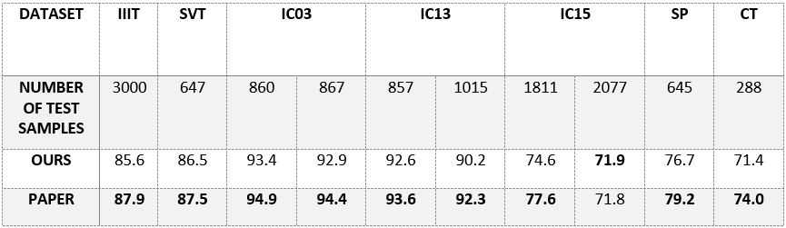

**What Is Wrong With Scene Text Recognition Model Comparisons? Dataset and Model Analysis**

[Paper](https://arxiv.org/pdf/1904.01906.pdf) | Official [Implementation](https://github.com/clovaai/deep-text-recognition-benchmark)

**Train:**
* Download LMDB dataset for training and evaluation from [here](https://www.dropbox.com/sh/i39abvnefllx2si/AAAbAYRvxzRp3cIE5HzqUw3ra?dl=0).
* Show the path to the LMDB dataset in `config.py`.
* Run `python train.py` to train.

<br>

**Fine-Tuning:**
* Change `FT = True` in `config.py`
* Show the path to your custom LMDB dataset. Change `train_data` and `valid_data` in `config.py`
* Run `python train.py` to train.

<br>

**How to create your own LMDB dataset:**
```
pip3 install fire
python3 create_lmdb_dataset.py --inputPath data/ --gtFile data/gt.txt --outputPath result/
```
The sturcture of `data` folder:
```
data
├── gt.txt
└── test
    ├── word_1.png
    ├── word_2.png
    ├── word_3.png
    └── ...
```

<br>

**To run demo.py:**
* Download our trained weight from [here](https://www.dropbox.com/s/t3shjr8voy0ypwp/best_accuracy.pth?dl=0)
* Or run `download_weights.sh` in weights folder.
* Run `demo.py`.


**I trained the model with following configurations(150k iterations and 2 Tesla V100 GPUs):**

`TPS-ResNet-BiLSTM-Attn` 

```python
""" Default CONFIGURATIONS """
exp_name = 'logs'                                   # Where to store logs and models
train_data = '../data_lmdb_release/training/'       # path to training dataset
valid_data = '../data_lmdb_release/validation/'     # path to validation dataset

eval_data = '../data_lmdb_release/evaluation/'      # path to evaluation dataset
benchmark_all_eval = True                           # evaluate 10 benchmark evaluation datasets

manualSeed = 1111                                   # for random seed setting
workers = 4                                         # number of data loading workers, default=4
batch_size = 768                                    # input batch size
num_gpu = 1                                         # number of GPU devices, by default 0
num_iter = 300000                                   # number of iterations to train for
valInterval = 2000                                  # Interval between each validation
saved_model = ''                                    # path to model to continue training, if you have no any saved_model to continue left it as ''
FT = False                                          # whether to do fine-tuning
adam = False                                        # Whether to use adam (default is Adadelta)
lr = 1.0                                            # learning rate, default=1.0 for Adadelta
beta1 = 0.9                                         # beta1 for adam. default=0.9
rho = 0.95                                          # decay rate rho for Adadelta. default=0.95'
eps = 1e-8                                          # eps for Adadelta. default=1e-8'
grad_clip = 5                                       # gradient clipping value. default=5
baiduCTC = False                                    # for data_filtering_off mode
""" Data processing """
select_data = 'MJ-ST'                               # select training data (default is MJ-ST, which means MJ and ST used as training data)
batch_ratio = '0.5-0.5'                             # assign ratio for each selected data in the batch
total_data_usage_ratio = 1.0                        # total data usage ratio, this ratio is multiplied to total number of data
batch_max_length = 25                               # maximum-label-length
imgH = 32                                           # the height of the input image
imgW = 100                                          # the width of the input image
rgb = False                                         # use rgb input
character='0123456789abcdefghijklmnopqrstuvwxyz'    # character label
sensitive = False                                   # for sensitive character mode
PAD = False                                         # whether to keep ratio then pad for image resize
data_filtering_off = False                          # for data_filtering_off mode
""" Model Architecture """
Transformation = 'TPS'                              # Transformation stage. None|TPS
FeatureExtraction = 'ResNet'                        # FeatureExtraction stage. VGG|RCNN|ResNet
SequenceModeling = 'BiLSTM'                         # SequenceModeling stage. None|BiLSTM
Prediction = 'Attn'                                 # Prediction stage. CTC|Attn
num_fiducial = 20                                   # number of fiducial points of TPS-STN
input_channel = 1                                   # the number of input channel of Feature extractor
output_channel = 512                                # the number of output channel of Feature extractor
hidden_size = 256                                   # the size of the LSTM hidden state
```

<br>

**Results:**




**Notice**
* I just tried to reproduce their result, and the code is the same with official implementation.
* `baiduCTC = False` - authors of the paper said while they used `baiduCTC = False`their model achivied the highest result. I tried to nstall __baiduCTC__  but failed.
